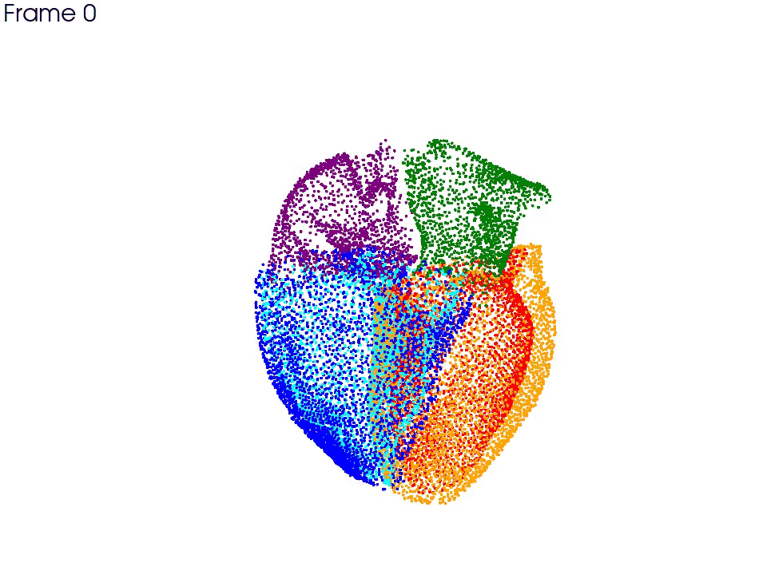
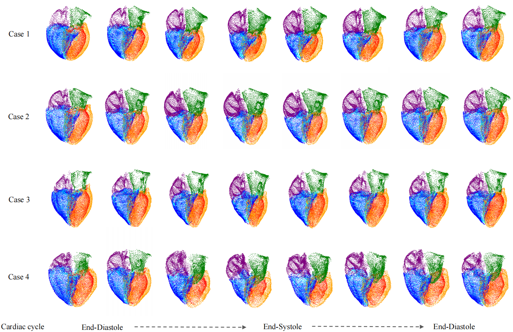
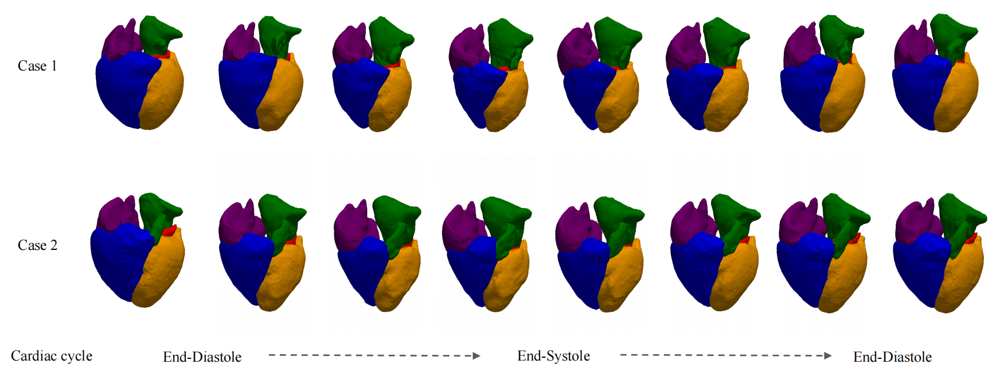
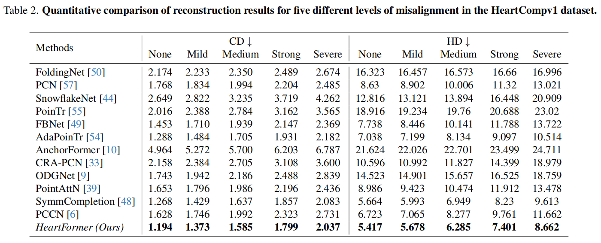

# HeartFormer: Semantic-Aware Dual-Structure Transformers for 3D Four-Chamber Cardiac Point Cloud Reconstruction 


## 🤹‍♂️ Visualizing 4D cardiac point cloud
| Case1                                           | Case2                                            |
|-------------------------------------------------|--------------------------------------------------|
|  |  |

## 🤹‍♂️ Visualizing completion in training progress


## Introduction


This is the proposed HeartFormer architecture.

## 🛠️ Environment

* Ubuntu 24.04.1 LTS
* Python 3.7.9
* PyTorch 1.7.0
* CUDA 11.0

## 🔧 Prerequisite

Compile for cd and emd:

```shell
cd extensions/chamfer_distance
python setup.py install
```

**Hint**: Don't compile on Windows platform.

As for other modules, please install by:

```shell
pip install -r requirements.txt
```

## Dataset

- The total size of the dataset is **12.5 GB**, which exceeds the **50 MB** limit for supplementary materials.
- The full dataset will be released on our GitHub repository upon acceptance.
- We provide a **pseudocode** for synthetic dataset generation in the supplementary material, which can be used to generate the full dataset locally.
- For convenience, we also include **10 test samples** in the supplementary material for evaluation.


## 💻 Training

In order to train the model, please use script:

```shell
python main_HeartFormer.py --config ./cfgs/models/HeartFormer.yaml --exp_name <path of output path>
```

## Testing

In order to test the model, please use follow script:

```shell
python main_HeartFormer.py --test --ckpts ./checkpoints/ckpt-best.pth --config ./cfgs/models/HeartFormer.yaml --exp_name <path of output path>
```

## 🏰 Model

The well-trained model for testing is in `checkpoint/`.

## 🚩 Results

### Qualitative Result





### Quantitative Result




